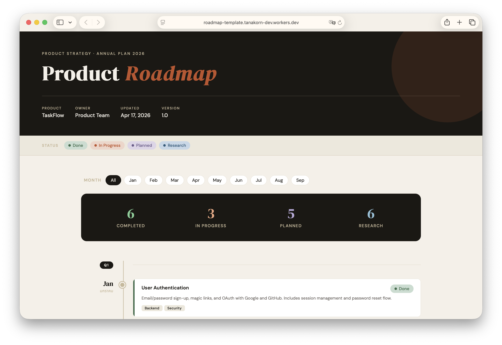

# roadmap-template

> Beautiful, data-driven product roadmap. Zero dependencies. Just HTML + JSON.

[](./LICENSE)


A single-file HTML roadmap you publish by editing **one JSON file**. No framework, no build step, no Node required. Fork it, change the data, push to any static host.



**Live demo:** https://your-username.github.io/roadmap-template/

## Features

- **One file to edit.** `roadmap-data.json` drives the entire page — header, months, cards, summary counts.
- **Zero build.** One `index.html` with inline CSS and vanilla JS. Open it behind any static server and it renders.
- **Status-aware.** Four statuses out of the box: `done`, `progress`, `planned`, `research`, each with its own color.
- **Feature highlight.** Flag a card with `"feature": true` to get a colored left border and shadow.
- **Month filter.** Click a month pill to focus; empty quarters auto-hide.
- **Bilingual ready.** Each month has `en` and `th` labels. Swap `th` for any secondary language your team reads.
- **Mobile first.** Timeline collapses cleanly under 680px.

## Quick Start

```bash
# 1. Use the template (or clone)
git clone https://github.com/your-username/roadmap-template.git
cd roadmap-template

# 2. Copy the example data to your real roadmap file
cp roadmap-data.example.json roadmap-data.json

# 3. Serve locally (pick one)
python3 -m http.server 8000
# or
npx serve .
```

Open <http://localhost:8000> and edit `roadmap-data.json` — the page reloads with your content.

> **Why a local server?** Browsers block `fetch()` over `file://`. `index.html` detects this and shows instructions if you open it directly.

`roadmap-data.json` is listed in `.gitignore` so your real roadmap stays local until you decide to publish it. The shipped `roadmap-data.example.json` is what renders on a fresh clone and on the demo site.

## Customization

### Editing content

Everything visible on the page comes from `roadmap-data.json`. Open it in any editor and:

- Change `meta.product`, `meta.year`, `meta.owner`, `meta.lastUpdated`, `meta.version` to populate the header.
- Set `meta.eyebrow` (the small uppercase line above the title) and `meta.title` (supports one `<em>...</em>` for the accent word).
- Set `meta.footer` to override the footer text.
- Add, reorder, or remove `quarters[]` and their `months[]` — the month filter and Q dividers regenerate automatically.
- Flip `month.current` to `true` on the month you're in; it gets the accent dot and a "◀ current" marker.

### Colors

All colors are CSS custom properties near the top of `index.html`:

```css
:root {
  --ink:         #1a1814;   /* text + dark panels */
  --paper:       #f5f0e8;   /* page background */
  --cream:       #ede8dc;   /* secondary background */
  --warm-mid:    #c8b89a;   /* muted labels */
  --accent:      #c0522a;   /* accent + current-month dot */
  --done:        #3a6b4a;
  --in-progress: #c0522a;
  --planned:     #6b5b8a;
  --research:    #2a5a7a;
}
```

Change one variable and the whole page updates.

### Fonts

Fonts come from Google Fonts via a single `<link>` in `<head>`. Defaults are `DM Serif Display` (headings), `DM Sans` (body), and `Noto Sans Thai` (Thai fallback). Swap the `<link>` URL and the `font-family` declarations in the `<style>` block to replace them.

## JSON Schema

```jsonc
{
  "meta": {
    "product":     "Your Product",                           // required
    "year":        2026,                                     // required
    "owner":       "Your Team",                              // optional
    "lastUpdated": "2026-04-17",                             // optional (ISO date)
    "version":     "1.0",                                    // optional
    "eyebrow":     "Product Strategy · Annual Plan 2026",    // optional
    "title":       "Product <em>Roadmap</em>",               // optional, one <em> tag supported
    "footer":      "Your Product · Roadmap © 2026"           // optional
  },
  "quarters": [
    {
      "id":    "q1",                                         // required, unique
      "label": "Q1",                                         // required, shown in pill
      "months": [
        {
          "id":      "jan",                                  // required, unique (used by filter)
          "en":      "Jan",                                  // required, primary label
          "th":      "มกราคม",                               // optional, secondary label
          "current": false,                                  // optional, highlights the month
          "cards": [
            {
              "title":       "Feature Name",                 // required
              "description": "What it is and who it's for.", // required
              "status":      "done",                         // required: done|progress|planned|research
              "feature":     true,                           // optional, adds left-border accent
              "tags":        ["Backend", "API"]              // optional array of strings
            }
          ]
        }
      ]
    }
  ]
}
```

The shipped `.github/workflows/validate.yml` parses this file on every PR to catch broken JSON before it reaches `main`.

## Deployment

All you're hosting is static files. Any static host works.

### Cloudflare Pages

1. Create a new project and point it at your fork.
2. **Build command:** (leave empty)
3. **Build output directory:** `/`
4. Deploy. Cloudflare serves `index.html` at the root.

### GitHub Pages

1. Settings → Pages → **Source:** `Deploy from a branch`.
2. Pick `main` and `/` (root). Save.
3. Your site is live at `https://<user>.github.io/<repo>/`.

If you want to ship your private `roadmap-data.json` via Pages, remove the entry from `.gitignore` *in a private fork only*.

### Netlify

1. **New site from Git** → select the repo.
2. **Build command:** (leave empty). **Publish directory:** `.`.
3. Deploy.

### Any other static host

Upload `index.html`, `roadmap-data.json` (or `roadmap-data.example.json`), and `screenshot.png` to the webroot. Done.

## Project Structure

```
roadmap-template/
├── index.html                    # The whole app (HTML + CSS + vanilla JS)
├── roadmap-data.example.json     # Example data shipped with the repo
├── roadmap-data.json             # Your data — gitignored, takes precedence when present
├── .github/workflows/validate.yml # CI: JSON validation on PR
├── .gitignore
├── CLAUDE.md                     # Guide for AI assistants working in this repo
├── CONTRIBUTING.md
├── LICENSE                       # MIT
└── README.md
```

## Contributing

Bug reports and pull requests welcome. See [CONTRIBUTING.md](./CONTRIBUTING.md) for the process.

## License

[MIT](./LICENSE) © 2026 Tanakorn Phoochaliaw
